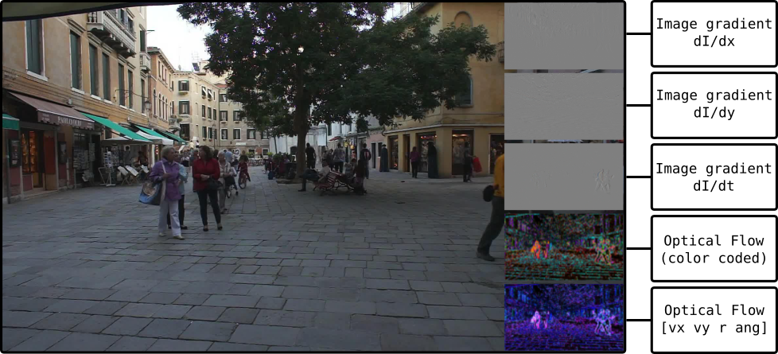

# Computer Vision / Image Processing Toolbox (accel.)
Just a small set of useful GLSL shaders for accelerated calculation of:
- Image gradient temporal
- Image gradients spatial
- Gaussian blur/ Box blur
- Optical Flow (Lucas Kanade method)

## Example Usage and output

python main.py --images './images'

Iterate through frames by using right arrow key.

The current implementation of the Lucas Kanade method makes use of a form of diluted gaussian kernel in order to comprise more image information. However the output is noisy, since the method is not well suited for a dense approach.
